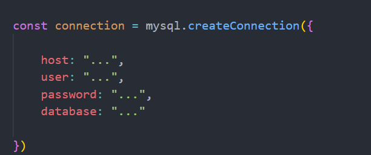

# CS4400_Phase4 Final Project

## Setup

The database chosen for this project is MySQL. Express JS was used as the server component of the project. In server.js, the connection from the server to the database is made. In order to apply the server to your database, just change the following values at the top of ```server.js``` file:



For us, we used localhost, our individual usernames and passwords. We were using the restaurant_supply_express provided, so for database: "restaurant_supply_express" was what we used.

To install all the necessary packages, run the command:
npm install. If you do not have npm or node, you will have to install those. After you run this command, and change the before values to your own credentials, the server should be ready to connect.

To start up the server, make sure you are in the same directory as server js and type: ```node server.js```

It current listens on port 8080. You can change this setting in the server file

Then, in your browser of choice, navigate to ```localhost:8080/main``` to access the website. You should be good to go from there. If you have trouble with the MySQL database select, make sure you have disabled ```only_group_by_full``` in MySQL.

## Technologies

For this project, the GUI of chose was a locally hosted website running on basic Javascript, HTML, and CSS. The only two unique packages used other than native tools was Express JS and MySQL2 packages. Express JS allows for an easy start-up to the server process, enabling us to host the website locally. MySQL2 package bridges the javascript and allows connection to your local MySQL instance. Other than that, no other technologies were used in the making of this project.

Using the server and mysql2 package, we were able to successfuly host and connect a website to MySQL where we created a GUI using the basic webdev tooling of Javascript, CSS, and HTML.

## Work Allocation

### Joel

* Created original infrastructure for mysql and express instances.
* Assisted in the creation of many of the HTML pages and styling aspects of many pages.
* Created the server-side infrastructure handling for site navigation and HTML request handling.

### Matt

* Created web pages and stylings for all the views.
* Created many front-end and back-end listeners to connect procedures to the MySQL2 database.
* Added input validation listeners for some pages to handle misguided user input

### Nifemi

* Coordinated team efforts and organized the outline for the structure of the project.
* Created many of the HTML pages and stylings for the project.
* Both created and assisted in establishing front-end and back-end handlers for some procedures.
